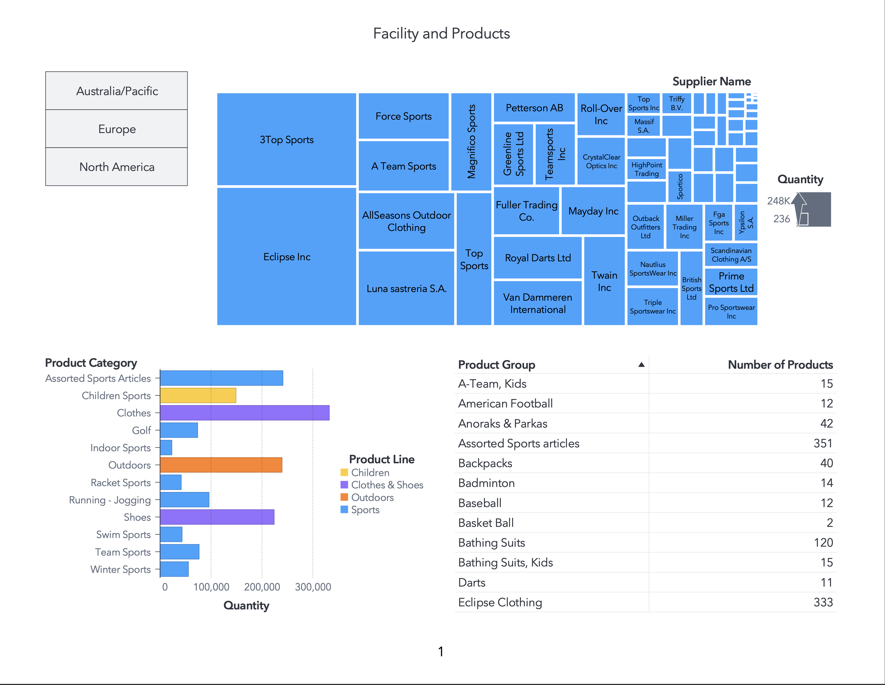

# SAS Visual Analytics: Facility & Product Distribution Dashboard

**Tools:** SAS Visual Analytics · SAS Studio · Business Intelligence · Dashboard Reporting · Data Visualization

---

# Business Problem

Organizations with multiple suppliers, facilities, and product lines require centralized reporting to better understand inventory distribution, supplier concentration, and product category performance.

This project uses SAS Visual Analytics to build an interactive dashboard analyzing supplier activity, product categories, and product line distribution across multiple geographic regions.

The objective was to improve operational visibility and support inventory-focused business decision-making through interactive analytics and dashboard reporting.

---

# Project Overview

The dashboard provides:
- supplier-level product distribution analysis
- regional filtering capabilities
- product category comparisons
- product group inventory visibility
- quantity-based performance analysis

The dashboard was designed to identify:
- high-volume suppliers
- dominant product categories
- regional product distribution patterns
- inventory concentration across facilities

---

# Tools & Technologies

- SAS Visual Analytics
- SAS Studio
- SAS Reporting
- Business Intelligence Dashboards
- Interactive Filtering
- Data Visualization

---

# Analytical Focus Areas

- Supplier analysis
- Product distribution analysis
- Inventory reporting
- Regional filtering
- Dashboard visualization
- Business intelligence reporting
- Interactive analytics

---

# Dashboard Components

## Supplier Quantity Treemap

The dashboard includes a treemap visualization displaying supplier contribution by quantity, allowing quick identification of high-volume suppliers.

Key suppliers include:
- Eclipse Inc
- 3Top Sports
- Force Sports
- AllSeasons Outdoor Clothing
- Luna sastreria S.A.

---

# Product Category Analysis

The dashboard analyzes inventory quantity across major product categories, including:
- Assorted Sports Articles
- Children Sports
- Clothes
- Outdoors
- Running & Jogging
- Shoes
- Team Sports
- Winter Sports

---

# Product Group Reporting

A detailed reporting table provides visibility into:
- product groups
- quantity distribution
- number of products by category

Examples include:
- Assorted Sports Articles
- Bathing Suits
- Backpacks
- American Football
- Eclipse Clothing

---

# Geographic Filtering

Interactive filters allow users to analyze inventory distribution by region:
- Australia/Pacific
- Europe
- North America

This functionality supports regional operational analysis and product segmentation.

---

# Dashboard Visualization



---

# Key Insights

- Supplier inventory distribution is concentrated among a small number of major suppliers.
- Clothing and outdoor-related product lines represent significant portions of inventory volume.
- Regional filtering improves operational visibility and supports targeted analysis.
- Interactive dashboards improve accessibility and reporting efficiency for business users.

---

# Repository Structure

```text
data/        -> project data information
Images/      -> dashboard screenshots and visual outputs
reports/     -> exported PDF dashboard reports
README.md    -> project overview and documentation
```

---

# Files

| File | Description |
|------|-------------|
| `reports/Family_Products_on_Apr_25__2026.pdf` | Exported SAS Visual Analytics dashboard report |
| `Images/Facility-and-Products.png` | Dashboard visualization screenshot |
| `data/README.md` | Information regarding project data source and usage |

---

# Portfolio

Portfolio Website: https://cameronbatts.github.io/

GitHub Profile: https://github.com/cameronbatts
